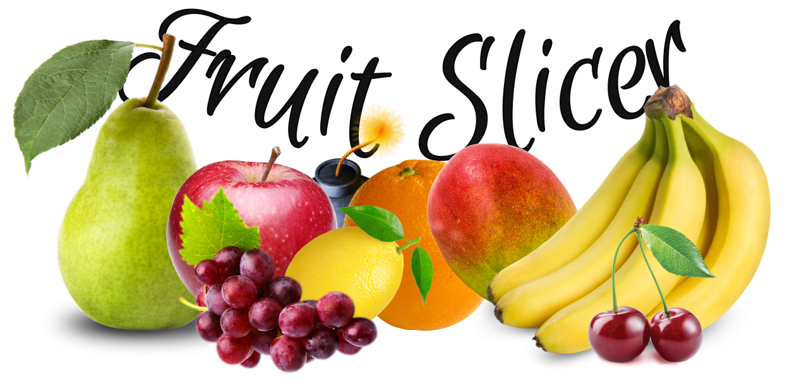

# Fruit Slicer!
Fruit slicing game using HTML/CSS/jQuery.

## Instructions: 
Go to https://esmps.github.io/fruitslicer/ and slice as many fruits as you can by scrolling your mouse over each one (no clicking!). But ... watch out for the *BOMBS*!

## About:
This is a project given by a Udemy course I am taking. However, I didn't stop at the end of the tutorial. I added a bomb feature which will end the game if you scroll over it by accident and will award you a point for ignoring it. The CSS is of my own design, rather than following the tutorial, and I created the title feature myself.
